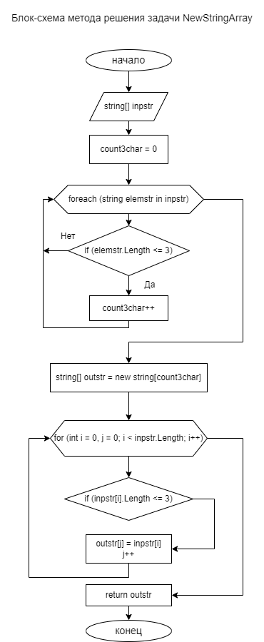

# Заключительная контрольная работа к блоку 1 курса "Разработчик"

## Создание удаленного и локального репозитория

Создаем репозиторий на сайте GitHub.com, добавляем в него файл лицензии 
(можно не делать) и файл READMI.md (этот файл,  можно создать и локально).
Копируем адрес только что созданого репозитория и клонируем его в рабочую 
папку на локальной машины командой:

~~~
    git clone https://github.com/VladimDmitriev/final-test.git
~~~

В результате выполнения команды получаем локальную копию созданого
репозитория, в котором будет выполнятся контрольная работа.

## Создание блоксхемы алгоритма.

Программу, согласно условия задачи, проектируем модульной. Основные модули:

1. Метод void Main() - основной модуль, в нем будут создаваться   массивы строк для тестирования алгоритма задачи, и вызываться методы решения задачи. Также добавим вызов вспомогательного метода вывода в терминал тестовых (исходных) и обработанных массивов.

2. Метод string[] NewStringArray(string[] inpstr) - основной метод, содержащий алгоритм решения задачи. Для него создадим блок-схему.

3. Метод void PrintStrinArray(string[] strprint) - вспомогательный метод для вывода исходных и обработанных массивов.

Ниже представлена блок-схема решения задачи (модуль NewStringArray).

## Создание проекта и реализация программы алгоритма

Создаем проект задачи спомощью команды:

>  dotnet new console

В файле Program.cs реализуем алгоритм задачи, и производим проверку работоспособности готовой программы, при наличии ошибок, проводим анализ, отладку и исправление.

